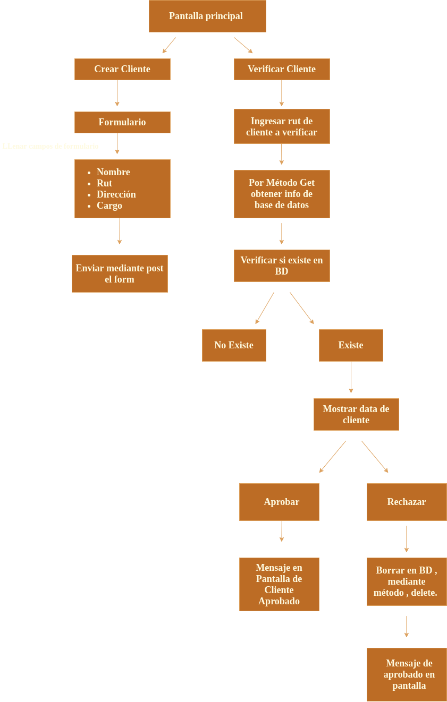

### Introducción

El uso de la web es bastante fácil , se le da opción al usuario de crear un nuevo cliente o bien , buscar y ver algún usario previamente creado , mediante el rut del cliente .
 
Como segunda funcionalidad , después de buscar un usuario que se encuentre creado , se podrá eliminar de la base de datos o bien  , dejar que permanezca en la base de datos , el cliente.

### Diagrama de flujo.

 ### Tecnologías usadas para la creación de este reto:
- Para la parte del cliente se uso la biblioteca de programación de javascript *React* .
- Para el Back-end del proyecto se usó *Express , NodeJs , y MongoDB*.
### Deployment

